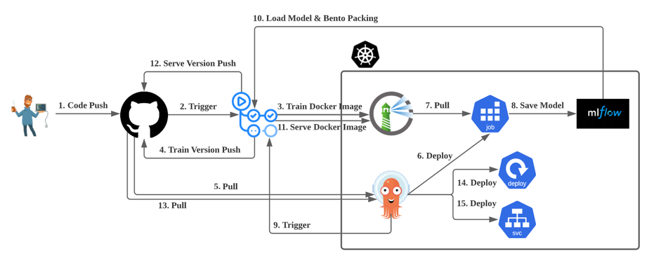

# K8s에서의 지속적 ML 서비스를 위한 CI CD CT(feat. Github Actions + ArgoCD)

지속적 서비스를 위해선 코드 업데이트에 대해 빠른 배포가 가능해야 한다.

- **코드 업데이트에 대한 학습 및 배포 자동화**

### Stacks

1. Github Actions
2. Harbor
3. ArgoCD
4. MLflow

### 시나리오

위 그림은 개발자가 Github에 소스코드를 업데이트 했을 때 자동으로 실행되어야 하는 단계를 그린것이다.

간단히 이야기해보자.

1. Github 레포지토리에 소스코드 업데이트
2. 학습을 위한 Github Actions Workflow가 실행되어 학습을 위한 도커 이미지 생성 및 Harbor에 Push 그리고 Github 레포지토리에 버전 업데이트
3. ArgoCD가 학습을 위한 Job을 생성함(2번 단계에서 버전을 업데이트 했으므로 ArgoCD는 OutOfSync 상태가 되어 업데이트 함)
4. Job에선 Harbor에 올라가 있는 학습을 위한 도커 이미지를 불러와서 실행하고 학습이 끝나면 Mlflow에 모델 로깅
5. Job이 끝나면 ArgoCD에 PostHook을 이용해 배포를 위한 Github Actions Workflow가 실행
6. 배포를 위한 Workflow에선 Mlflow에 저장된 이미지를 불러와서 BentoML로 패킹한 뒤 도커 이미지로 빌드하여 Harbor에 Push 그리고 Github 레포지토리에 버전 업데이트
7. ArgoCD가 변동사항을 확인하여 Deployment를 롤링 업데이트하고 필요시 Service 업데이트

